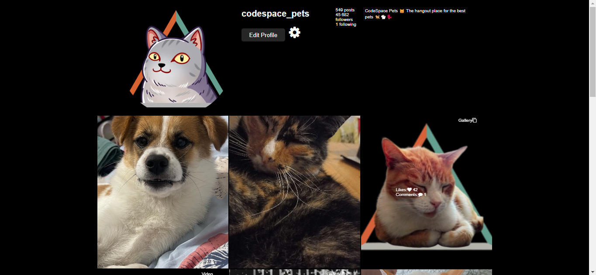

# Learning Reflections README 

## **6.15 CodeSpace Pets Instagram Profile Project**

### Overview

### Reflections

#### Areas of Mastery

- **CSS Layout Techniques**: 
Sure! Here are the layout techniques used in the provided CSS code, listed in first-person form:

- **Flexbox**:
  - I used Flexbox to arrange children in a row within the `.profile` class.

- **Grid**:
  - I employed Grid in the `.gallery` class to create a grid-based layout for gallery items.

- **Positioning**:
  - I utilized absolute positioning to position `.gallery-item-info` within `.gallery-item` upon hover.

- **Percentage Width and Max-width**:
  - I employed percentage widths and max-widths to ensure responsive design, setting `width: 100%` and `max-width: 100%` in `.gallery-item img`, `.profile img`, and `.gallery-image img`.

- **Centering**:
  - I used Flexbox properties (`justify-content: center` and `align-items: flex-end`) in the `.wrapper` class to achieve vertical and horizontal centering of the spinning wheel.

These techniques, implemented collectively, contribute to the creation of a flexible, responsive, and visually appealing layout for the webpage.
- **Responsive Design**: 
Sure! Here are the responsive design implementations listed in first-person form:

- **Images**: I ensure responsive design for images by setting their `width` and `max-width` properties to `100%` within a media query targeting screen widths up to `1000px`. This allows the images to scale down proportionally to fit smaller screen sizes while maintaining their aspect ratio.

- **Spinning Wheel**: Although not explicitly stated in the CSS, the spinning wheel's responsiveness can be inferred from the fact that its container has a width of `100%` within the media query. This allows the spinning wheel to adjust its size according to the width of its container, making it responsive to different screen sizes.
- **Styling Elements**: 
- **Selectors**:
  - Element type selectors (e.g., `body`, `img`, `div`).
  - Class selectors (e.g., `.profile`, `.profile-image`, `.btn`).
  - Descendant selectors (e.g., `.profile-stats li`).

- **Properties and Values**:
  - Visual properties like `display`, `max-width`, `margin`, `padding`, `background-color`, `color`, `font-family`, `border-radius`, `width`, `height`, `object-fit`, `text-align`, `cursor`, `list-style`, `z-index`.
  
- **Box Model**:
  - Utilized properties like `margin`, `padding`, `border` to control the layout of elements.

- **Cascade and Specificity**:
  - Utilized CSS rules to apply styles to specific elements, classes, and IDs. Specificity was employed to override styles as needed.

- **Responsive Design**:
  - Employed media queries (`@media`) to apply different styles based on screen width (`max-width: 1000px`).

- **Pseudo-classes and Pseudo-elements**:
  - Used `:hover` pseudo-class to apply styles when hovering over elements.
  - Used `::before` pseudo-element to insert additional content into the DOM.

#### Challenges Faced

- **Responsive Design for Smaller Screens**:
    -Had issues making the wheel stable and removing the padding to the right of the images when in smaller screens
- **Hover and Focus Effects**: 
    -Couldn't utilize focus effects effectively.

#### Areas for Improvement

- **Advanced CSS Properties**: 
    I could enhance the CSS by incorporating more advanced properties like transitions, animations, transforms, and filters. These properties would add interactivity and visual appeal to elements on the page, making the design more engaging.
- **Code Optimization**: 
     I can optimize the CSS code by reducing redundancy and improving code organization. By grouping similar styles together and extracting common styles into reusable classes, I can make the CSS more maintainable and easier to understand. Additionally, I should avoid using unnecessary specificity in selectors and minify the CSS file before deployment to improve page loading speed.
- **Creative Design Choices**:
     While the current design is functional, I see opportunities to enhance its visual appeal and creativity. Exploring different color schemes, typography choices, and layout options could make the design more visually appealing. Incorporating more visual elements such as icons, illustrations, or background patterns could also make the design more engaging. Additionally, experimenting with different hover effects, transitions, and animations could add polish and sophistication to the user experience.
#### Overall Learning Experience
    I learnt that the is a lot which I haven't learned, and as such, I need to go back to my notes.